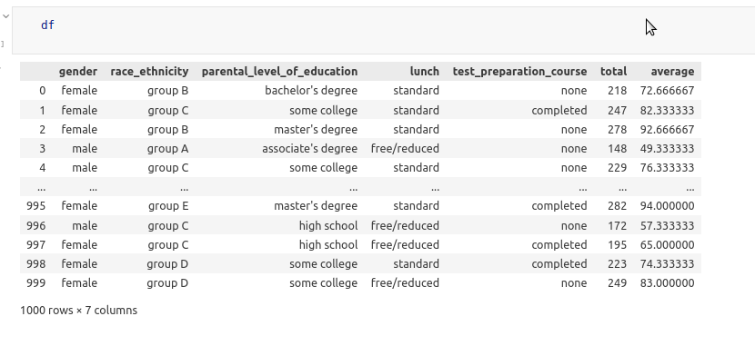
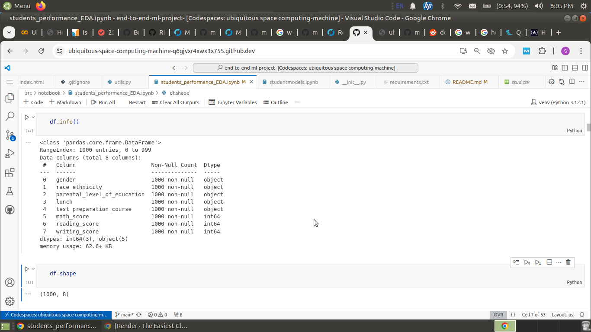
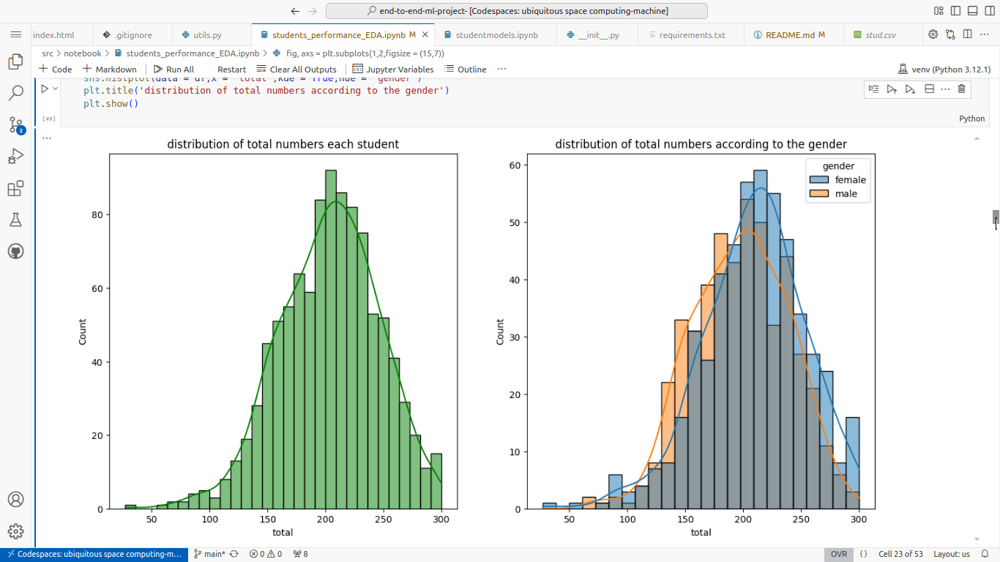
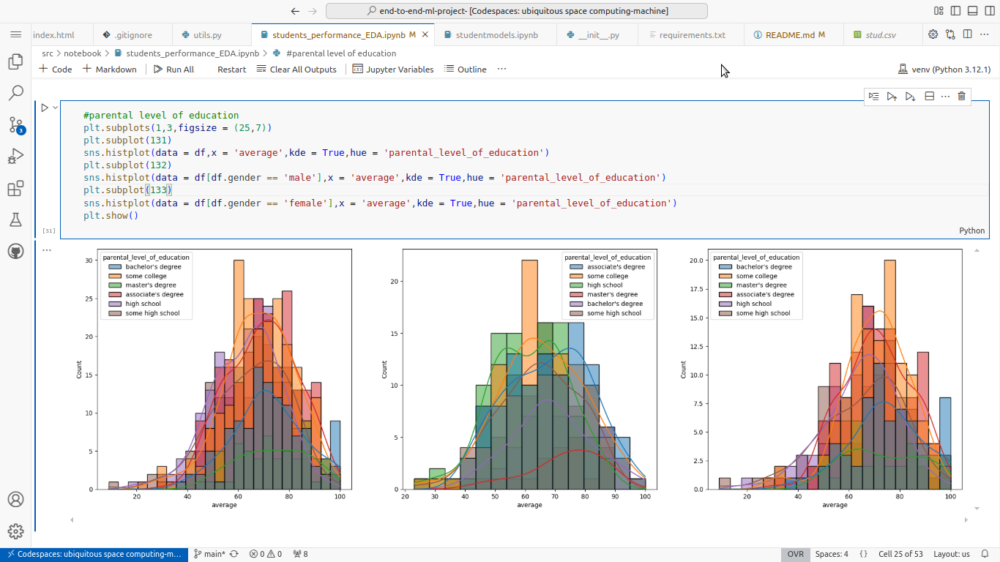

# Student performance prediction project-

## problem statement- 
this project is about student performance prediction using the independent features-- 

1.gender
2.race_ethnicity
3.parental_level_of_education
4.lunch
5.test_preperation_course
6.maths_score
7.reading_score
8.writing_score

feaures from 1-5 are categorical features and rest are numerical. numerical features i.e. maths_score,reading_score,writing_score are used to make two new featurs --- total and average --- and then all three numercal features are then droped from the dataset and average is made the dependent feature.

## EDA

1.dataset has shape 1000x8 initially that is converted to 1000x7.
2.dataset does not contain any null value.
3.dataset does not have any duplicate value.

render link ---
https://end-to-end-ml-project-t1b4.onrender.com